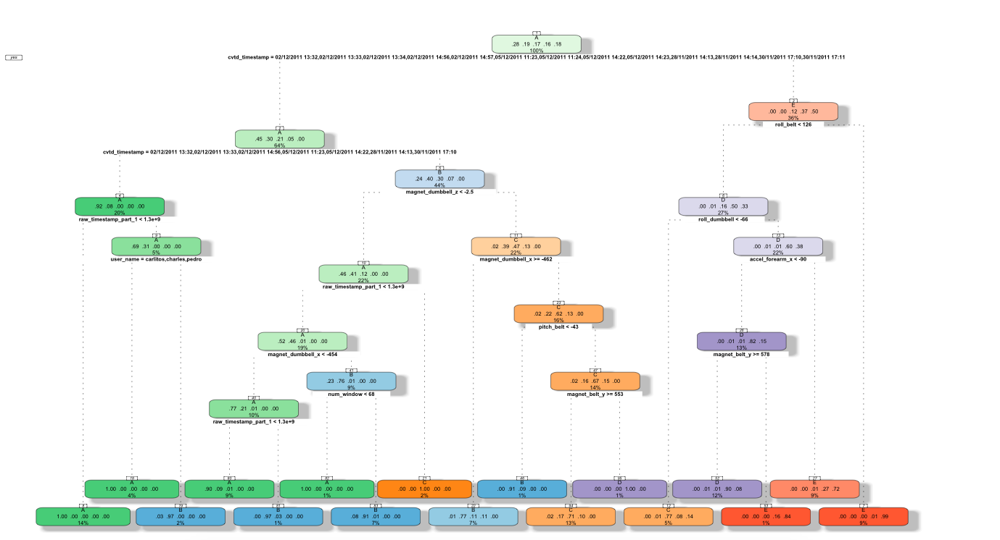

Assignment
When we first get the data, what we should do is to read it into R and then clean the 
data. We find that in the training data set, there are 19622 data sets with 160 variables 
in the testing data set, there are 20 data sets with 160 variables. the testing data set 
is used at the end for the prediction. The training set, however, should be divided into 
two groups for cross-validation with the ratio of 0.7, one is called mytrain, the other 
is called mytest.

However, not all the variables in the data set is suitable for the prediction. Therefore, 
we need to remove some variables that are not significant. First, we need to clean Near 
Zero Variance Variables. We use nearZeroVar code to do this work. After the first clean, 
we get 130 variables. After we clearly exam the data left, we found that some variables 
containing so many missing values. If there are a lot of missing values for the variable, 
it is not reasonable to use the variable to predict and the results will be distorted. 
Thus, we set the boundary of 60% to filter the variable. If the variable has over 60% 
missing values, it is not suitable for the prediction. After the second clean, we got 
only 58 variables( including the predictor classe). And these methods were also applied 
to the other two data set.

The data left contain not only integer variables but also non-integer such as user_name, 
cvtd_timestamp and classe. Therefore, using tree or bagging will be good choices. First, 
we fit tree method in the mytrain data and get the plot of the tree ( see in Figure 1). 
Then we need to do is to cross-validate the method and use code of  confusionMatrix to 
get the accuracy. The accuracy is  0.8681, which is not very bad for the prediction. 

Figure 1

But it is not enough, we can improve the accuracy by using another method, call random 
forests. It is quite similar with the tree method but use bootstrap to split the variables 
and after the cross-validation, we can get the accuracy of 0.9983 and in most case, we are 
satisfied with this result.

 And finally, we can predict the testing data set by using random forest.
